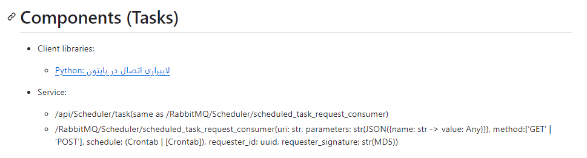

# محیط یکپارچه ویرایش دیاگرام

## در pycharm


## در VSCode


## Github.dev


# گردش کار ساخت سرویس اسکجولر

## تعریف نیازمندی توسط معمار سیستم

در قالب یک یوزر استوری تعریف و به دولاپر اساین می شود:

* Who:

معمار سیستم

* What:

به یک سیستم اسکجولر نیازداریم که بتواند حالت های بسیار فلکسیبلی از تقویم زمانبندی را ایجاد نماید. زمانبندیهای مورد نظر
شامل:

- هر 10 روز و 3 ساعت یک بار
- پنجشنبه ها ساعت 17:00
- شنبه ها ساعت 4:00
- روز سوم هر ماه (تاریخ 3) و ساعت 15:00
- ترکیب این موارد با هم

اسکجولر لازم است قادر باشد در یک زمان از قبل تعیین شده، با فاصله زمانی حداکثر یک سال، یک وظیفه محوله را اجرا نماید.
وظیفه در قالب یک فانکشن یا API است که لازم است به صورت پارامتریک و با قابلیت ارسال پارامترهای متغیر فانکشن یا API برای
اسکجولر قابل تعریف کردن باشد.

قابلیت لازم است به نحوی پیاده سازی شود که برای سرویس های موجود مبتنی بر Python و C++ و C# قابل استفاده باشد. قابلیت لازم
است در ساده ترین حالت ممکن در سرویس های موجود قابل استفاده باشد.

ایجاد یک کانال دسترسی به سرویس که در تمامی پلتفرمهای استفاده کننده قابل استفاده باشد، مانند Message Queue یا API یا ...
قابل استفاده است.

وظایف اسکجول شده لازم است در صورت فیل شدن داکر و بازیابی خودکار توسط اینفرااستراکچر داکر/کوبرنتیز به صورت خودکار بازیابی
گردد.

* Why:

برنامه نویس های بخش هایم مختلف قادر باشند در بخش های مختلف برنامه هایشان هر نوعی از اسکجول را تعریف نمایند و برای این
کار کمترین زمان را رفع کنند و به دانش برنامه نویسی خارج از زبان برنامه نویسی تخصصی خود و حوزه کاری خود نیاز نداشته
باشند.

تا بتوانیم انواع اسکجول متنوع از هر نوعی را در قابلیت های مختلف برنامه ایجاد کرد.


## طراحی سرویس توسط دولاپر

در فایل [README.md](https://github.com/b-raisdana/Schedular/blob/main/README.md) سرویس نگهداری می شود و تغییرات بعدی در همان محیط IDE/Editor در داخل آن ویرایش می شود و بخشی از کدریوی است.

می توان Product Owner سروریس های زیرساختی و SDK را  System Architect در نظر گرفت.

هر تسکی که وارد طراحی می شود از لیست Component / Taskها در فایل README.md حذف و لینک README.md بخش مربوطه جایگزین آن می شود تا در سطح ماکزیمم هرچیز فقط یکجا داکیومنت بشود.

مثلا وقتی طراحی اولین Task در Services شروع می شود تسکهای زیر Services به فایل README.md مربوطه منتقل می شود و لینک آن جایگزین توضیحات می شود. مانند ```[Python: لایبراری اتصال در پایتون](Client/Python/README.md)``` که جایگزین اکتیویتی های کلاینت شده است.


## ایجاد Taskها توسط دولاپر

برای هر کامپوننت یک Task ساخته می شود.

ایجاد یک Task ناشی از نتیجه ایجاد یک User Story یا یک Task دیگر است.

هر Task مراحل (Sub-Task) زیر را طی می نماید:

| Phase     | Sub-Task | Assignee                                         | Description                                                                                                                                                                                                                                                                                                                                                                                                                                                                |
|-----------|----------|--------------------------------------------------|----------------------------------------------------------------------------------------------------------------------------------------------------------------------------------------------------------------------------------------------------------------------------------------------------------------------------------------------------------------------------------------------------------------------------------------------------------------------------|
| Design    | AC       | Developer                                        | در اولین گام تعاریف کلیدی تسک شامل DoD (اسکسپشن های احتمالی نسبت به DoD کلی)  و ACCEPTANCE-CRITERIAL نهایی شده و با تأیید شخصی که Task را اینیشیت کرده است در JIRA آپدیت می شود. <br>Acceptance Criteria سناریو محور و با زبان When-Given-Then طراحی بشوند. <br>شیوه تأمین قابیلت جدید باید pseudo-code نوشته بشود. <br>در این مرحل لازم است SOLID و Design-Pattern قابل مشاهده باشد. ساختار کلاسها، برکدان توابع، نامگذاری نهایی شده و عینا همان لازم است پیاده سازی شود. |
| Design    | BDD      | Programmer                                       | هر سناریوی Acceptance Criterial یک تست <br> حداقل یک تست باید فیل بشود                                                                                                                                                                                                                                                                                                                                                                                                     |
| Implement | CODE     | Programmer                                       | اگر سودوکد قابل پیاده سازی نباشد، لازم است با تأیید دولاپر تغییر داده بشود تا در کدریویو عدم انطباق تشخیص داده نشود.                                                                                                                                                                                                                                                                                                                                                       |
| Implement | REV      | Developer<br>Peer Programmer<br>System Architect | ریویو بر اساس چک لیست حداقل شامل <br>* انطباق با سودوکد <br>* تستهای بهیورال پاس بشوند <br>* تست MyPy و لینتر                                                                                                                                                                                                                                                                                                                                                              |

## ایجاد تسک برای ایشیو

اکسپتنس کرایتریا به فرمت Regeneration Condition و Expected Behavior وCurrent Behavior

فلو و سودوکد لازم ندارد.
