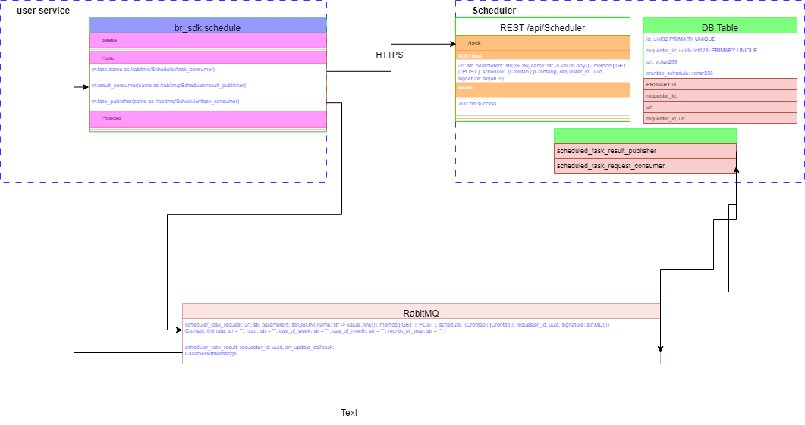

# Design Factors

[User Story: BL-0123456 can being linked to Jira, Confluence, and ...](UserStory.md)

## Functionality

### عملکردهای مورد نیاز (activity):

1. ارسال اطلاعات اسکجولد تسک از ریکوئستر به اسکجولر
2. لغو یک اسکجولد تسک – Postponed

* کنترل دسترسی با شناسه یکتای ماشین و PKI

3. لیست کردن اسکجولد تسک ها – Postponed

* کنترل دسترسی با شناسه یکتای ماشین و PKI

4. اطلاع به ریکوئستر از اجرای تسک اسکجول شده و نتیجه تسک

### نوع تسک (چه چیزی فراخوانی بشود؟):

1. یک API (route)
    * [x] GET
    * [x] POST
    * PUT: Postponed
    * HEAD: Postponed
2. یک فانکشن
    * چون اسکجولر لازم است با سیستم درخواست کننده داخل یک دامین قرار بگیرند، مشکلات زیادی را تحمیل می کند از این رو
      Postponed.
        1. سینک
        2. ای سینک

## Usability

با توجه به اینکه این عملکرد به عنوان یک قابلیت در SDK و پلتفرم توسعه داخلی قرار می گیرد لازم است به عنوان یک لایبراری
توسط استفاده کننده قابل استفاده باشد. نام لایبرای br_sdk.Scheduler در نظر گرفته می شود. لازم است این کانکتورها برای آن
توسعه داده شود:

* کانکتور Python برای
* کانکتور CPP
* کانکتور C# - با توجه به اینکه کد C# توسعه داده نمی شود، توسعه داده نشود.

### پروتکل ارتباطی (پارامترهای اسکجول چگونه به اسکجولر داده بشود؟):

1. API: POST

* مزیت:
* عدم نیاز به لایبراری بیرونی (در اکسر فریمورک ها بیلت این ساپورت می شود) و ساده تر بودن کانکتور سمت استفاده کننده
* امکان دریافت نتیجه و اطمینان از رجیستر شدن اسکجول توسط اسکجولر

2. Message Queue:

- REACT
- KAFKA – Postponed.

## Efficiency

تنظیم تاپیک‌های RabitMQ از طریق .env:
تسک ها نیازی به آتنتیکیت و آتورایز کاربر ندارند و فقط ریت لیمیت و سورس ریکوئیست آنها محدود شده است. از این رو بهتر است
روتهای تسک های اسکجول جداگانه و برای همین منظور ایجاد گردد.

## Flexibility

در بخس های دیگر پوشش داده شده است:

1. تنوع در نوع تسک قابل اجرا
2. تنوع در شیوه ارتباط با اسکجولر
3. تنوع در زبان برنامه نویسی مورد استفاده در سمت ریکوئستر

## Reliability

پشتیبانی گیری از دیتای تسک ها در دیتابیس (در ساده ترین حالت ممکن = pandas DataFrame) در یک والیوم پرسیستنت و اسکجول کردن
تسک های ذخیره شده در زمان بازراه اندازی سرویس.

# High-level Topology

این فایل گرافیکی از نوع PNGاست اما در draw.io به شکل جالبی قابل مودیفای کردن است.

این فایل با Google Docs و REAME.md و GitHub و Confluence و ... به خوبی اینگریت می شود.

# Components (Tasks)

* Client libraries:
  * [Python: لایبراری اتصال در پایتون](Client/Python/README.md) 

* Service:
  * [Service](Service/README.md)
